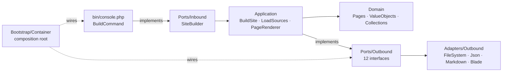

# Blougly

An ugly static site generator that gets out of your way.

**Requirements:** PHP 8.3+ · Composer 2 · **License:** [MIT](LICENSE) · **Contributing:** [CONTRIBUTING.md](CONTRIBUTING.md)

## What it is

Blougly reads a `source/` directory and writes a static site to an output directory. Markdown files with YAML front matter become pages, Blade templates lay them out, and assets are copied verbatim. The output is plain HTML: no PHP runtime, no database, no build-time asset pipeline. If you can serve a folder, you can serve a Blougly site.

It was built to practice Ports and Adapters. The architecture is the point, and the generator is what came out of practicing it. If you are looking for a feature-rich SSG, this is not one. If you are looking for a small codebase where every dependency is an interface and the domain imports nothing, you will like reading it.

## Install

```bash
git clone https://github.com/felipeverse/blougly
cd blougly
composer install
```

Docker is an alternative if you would rather not install PHP locally:

```bash
git clone https://github.com/felipeverse/blougly
cd blougly
docker compose run --rm blougly
```

## Usage

From a clone, as a contributor:

```bash
php bin/console.php
```

Installed as a dependency, as a site owner:

```bash
vendor/bin/console.php
```

Both accept the same options:

| Option | Default | Description |
|---|---|---|
| `--source` | `./source` | Source directory to read |
| `--output` | `./public` | Output directory to write |

Both `--source=x` and `--source x` are accepted. Defaults resolve against the current working directory. The output directory is deleted and recreated on every build, so never point `--output` at a directory you care about. A missing source directory is reported as an error and exits with status 1.

## Source types

Everything Blougly reads lives under the source directory. A source directory with no `assets/`, no `data/` and no `contents/` is perfectly valid, it just builds an empty site.

| Path | Accepts | Output | Notes |
|---|---|---|---|
| `assets/` | any file | `assets/` | Copied verbatim. Dotfiles are skipped. |
| `data/` | `.json` | `data/` | Any other extension throws a `RuntimeException`. Exposed to templates as `$data`. |
| `contents/` | `.md` | HTML | Front matter plus Markdown body. Any other extension throws a `RuntimeException`. Exposed to templates as `$contents`. |
| `site/` | `.blade.php` | `.html` | One page per file, extension swapped. Any other extension throws a `RuntimeException`. |
| `views/` | Blade templates | n/a | Rendered, not read as pages. |
| `config.json` | JSON | n/a | Optional. A missing file means an empty site config. Exposed to templates as `$site`. |

Two rules hold across all readers: dotfiles are ignored, and a file with the wrong extension fails the build with a `RuntimeException` naming the file.

Front matter keys are yours to choose. The demo site uses `title`, `published`, `tags`, `template` and `draft`, and each key becomes a template variable. `draft: true` excludes the page from the build. Omitting `template` outputs the Markdown body as-is.

## Architecture



`Domain` imports nothing. It holds pages, value objects and collections, and it has no idea whether pages come from Markdown, JSON or Blade. `Application` orchestrates: `LoadSources` fans out across the six source readers, `BuildSite` sequences the build, `PageRenderer` decides which template each page gets. `Ports` are the contracts, twelve interfaces on the outbound side and one on the inbound side. `Adapters` are the swappable implementations, with Blade, CommonMark and the local filesystem as the concrete choices. `Bootstrap/Container` is the only place that knows which implementation backs which interface.

The `--source` and `--output` options are composition config, not build input. `SiteBuilder::build()` takes no arguments, and `BuildPaths` normalizes both directories to canonical absolute paths so that consumers constructing the container programmatically get the same guarantees as the CLI.

## Development

```bash
make build         # build the site inside the container
make serve         # serve the site at http://localhost:8080 (PORT= to change it)
make clean         # remove the generated output
make help          # list every target
```

Without Docker:

```bash
php bin/console.php
vendor/bin/pest    # test suite
```

## License

MIT. See [LICENSE](LICENSE).
